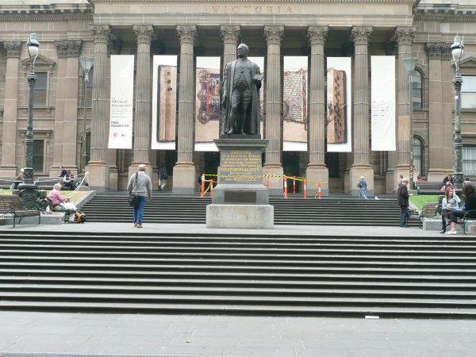

# Autopanoramic View

Toy implementation of image stitching algorithms

## Phase 1 

A traditional approach to image stitching

Pipeline includes:
- Detecting corners in input images
- Adaptive Non-Maximal Suppression to find the N best corners
- Extract descriptors or feature vectures for each corner
- Match features based off L2 norm between images
- Remove "outliers" of matching pairs or pairs that scored well but are not actually matches using RANSAC
- Estimate the homography between features of both images until successful condition is met
- Warp and blend images together

 ### Results
| Image 1      | Image 2       | Result
| -------------| ------------- | -------------
|   |   | 

TODO:
 - [ ] Stitch sequence of images together rather than 2 (Other projects to do for now!)

## Phase 2 

A deep learning approach to homography estimation 

ON PAUSE